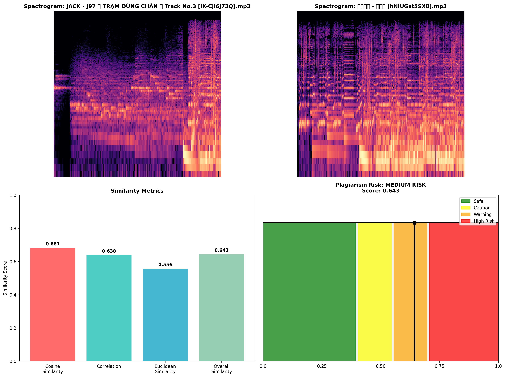

# Audio Plagiarism Detection System

This repository contains two distinct methods for detecting audio plagiarism between songs:

## Setup:
1. Clone the repository
2. Setup virtual python environment
3. Install dependencies: `pip install -r requirements.txt`

## Method 1: Traditional Audio Feature Analysis (quick_compare.py)

**How to use:**
```bash
python quick_compare.py
```

**How it works:**
- Extracts traditional audio features (MFCC, chroma, tempo, spectral features)
- Uses melodic, harmonic, rhythmic, and timbral similarity analysis
- Compares audio characteristics using statistical correlation and distance metrics
- Provides multi-dimensional similarity scoring

**Results - Method 1:**

🎵 Comparing: JACK - J97 ｜ TRẠM DỪNG CHÂN ｜ Track No.3 [iK-Cji6J73Q].mp3 vs 梦散之地 - 颜人中 [hNiUGst5SX8].mp3

📊 Similarity Results:
   Overall Similarity: 0.900 (Very Similar)
   Timbre Similarity:  0.941
   Harmony Similarity: 0.968
   Tempo Similarity:   0.696

🎼 Tempo Info:
   File 1 Tempo: 161.5 BPM
   File 2 Tempo: 112.3 BPM

🎯 Conclusion: These songs are very similar
    Similarity Score: 90.0%

## Method 2: Vision Transformer Spectrogram Analysis (audio_spectrogram_analyzer.py)

**How to use:**
```bash
python audio_spectrogram_analyzer.py
```

**How it works:**
The Vision Transformer (ViT) approach treats audio plagiarism detection as a computer vision problem:

1. **Audio to Spectrogram Conversion**: 
   - Converts audio files to log-scaled STFT (Short-Time Fourier Transform) spectrograms
   - Creates visual representations of audio frequency content over time
   - Saves spectrograms as 224x224 PNG images (standard ViT input size)

2. **Vision Transformer Processing**:
   - Uses pre-trained ViT model ("google/vit-base-patch16-224-in21k")
   - Extracts high-dimensional feature representations from spectrogram images
   - Leverages transformer attention mechanisms to understand audio patterns

3. **Similarity Analysis**:
   - Compares extracted features using cosine similarity, correlation, and Euclidean distance
   - Combines multiple similarity metrics with weighted averaging
   - Provides plagiarism risk assessment with color-coded visualization

4. **Visualization Output**:
   - Generates side-by-side spectrogram comparison
   - Shows similarity metrics in bar charts
   - Displays risk assessment with intuitive color coding

**Results - Method 2:**


The image shows:
- **Top**: Side-by-side spectrograms of both audio files showing frequency patterns over time
- **Bottom Left**: Bar chart comparing similarity metrics (Cosine Similarity: 0.681, Correlation: 0.638, Euclidean Similarity: 0.556, Overall: 0.643)
- **Bottom Right**: Risk assessment visualization showing MEDIUM RISK (Score: 0.643) with color-coded scale

**Method Comparison:**
- **Method 1 (Traditional)**: 90.0% similarity - "Very Similar"
- **Method 2 (ViT Spectrogram)**: 64.3% similarity - "Medium Risk"

The ViT method provides a more conservative assessment by analyzing visual patterns in spectrograms, while traditional methods focus on extracted audio features. Both methods complement each other for comprehensive plagiarism detection.

## Additional Tools:
- `plagiarism_detector.py`: Comprehensive multi-modal plagiarism analysis
- `same_note.py`: Continuous note detection utility